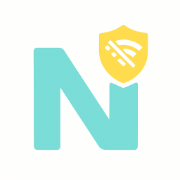
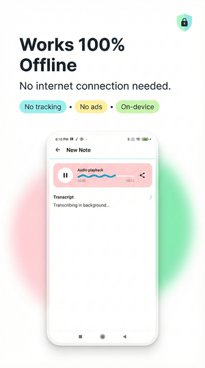
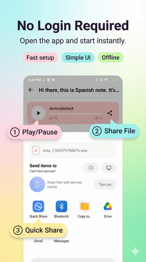
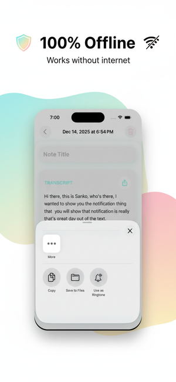
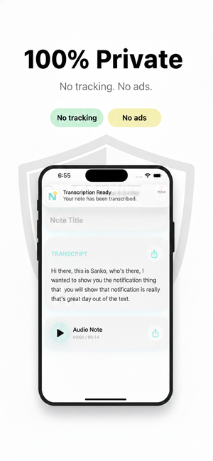
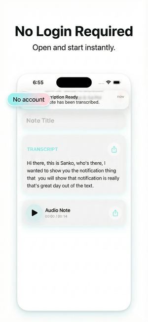

<div align="center">
  
  <h1>🎙️ Offline Audio Notes</h1>
  <p><strong>A fully offline voice memo app with AI-powered transcription for Android &amp; iOS</strong></p>

  <p>
    <a href="#features"></a>
    <a href="#demo"></a>
    <a href="#screenshots"></a>
    <a href="#architecture"></a>
  </p>

  <p>
    
    
    
    
    
    
  </p>
</div>

---

## 📲 Download

<p align="center">
  <a href="https://apps.apple.com/us/app/offline-audio-notes/id6756551299">
    
  </a>
  &nbsp;&nbsp;
  
  <br/>
  <sub>Android version coming soon</sub>
</p>

---

<h2 id="features">✨ Features</h2>

<table>
  <tr>
    <td align="center" width="25%">
      <h3>🔒</h3>
      <strong>100% Offline</strong><br/>
      <sub>Your voice notes never leave your device. No internet required.</sub>
    </td>
    <td align="center" width="25%">
      <h3>🤖</h3>
      <strong>AI Transcription</strong><br/>
      <sub>Powered by <a href="https://github.com/ggerganov/whisper.cpp">whisper.cpp</a>, OpenAI's Whisper running locally.</sub>
    </td>
    <td align="center" width="25%">
      <h3>⚡</h3>
      <strong>Real-time Recording</strong><br/>
      <sub>Clean, modern UI for effortless recording.</sub>
    </td>
    <td align="center" width="25%">
      <h3>📝</h3>
      <strong>Auto Titles</strong><br/>
      <sub>Transcriptions automatically generate note titles.</sub>
    </td>
  </tr>
  <tr>
    <td align="center" width="25%">
      <h3>🎨</h3>
      <strong>Modern Design</strong><br/>
      <sub>Material 3 (Android) &amp; Liquid Glass (iOS).</sub>
    </td>
    <td align="center" width="25%">
      <h3>📤</h3>
      <strong>Share Audio</strong><br/>
      <sub>Export and share recordings via any app.</sub>
    </td>
    <td align="center" width="25%">
      <h3>🌐</h3>
      <strong>Multi-language</strong><br/>
      <sub>Transcription supports 99+ languages.</sub>
    </td>
    <td align="center" width="25%">
      <h3>🔋</h3>
      <strong>Background Processing</strong><br/>
      <sub>Transcription works even when app is closed.</sub>
    </td>
  </tr>
</table>

---

<h2 id="demo">🎬 Demo</h2>

<div align="center">
  
  <p><sub>Recording and transcribing a voice note in real-time</sub></p>
</div>

---

<h2 id="screenshots">📱 Screenshots</h2>

<table>
  <tr>
    <th colspan="3" align="center">
      
    </th>
    <th colspan="3" align="center">
      
    </th>
  </tr>
  <tr>
    <td align="center"></td>
    <td align="center"></td>
    <td align="center"></td>
    <td align="center"></td>
    <td align="center"></td>
    <td align="center"></td>
  </tr>
</table>

---

<h2 id="architecture">🏗️ Architecture</h2>

```
offline_audionotes/
├── 📱 android_app/              # Android (Kotlin + Compose)
│   ├── app/src/main/
│   │   ├── cpp/                 # JNI bindings for whisper.cpp
│   │   ├── java/                # Kotlin source code
│   │   └── res/                 # Android resources
│   └── gradle/
├── 🍎 ios_app/                  # iOS (Swift + SwiftUI)
│   ├── OfflineAudioNotes/
│   │   ├── App/                 # App entry point
│   │   ├── Data/                # Repository implementations
│   │   ├── Domain/              # Models & Service interfaces
│   │   ├── Services/            # Audio, Transcription, Background
│   │   ├── UI/                  # Screens, Components, Theme
│   │   └── whisper.xcframework
│   └── ThirdParty/
├── 🤖 whisper.cpp/              # AI model (git submodule)
└── 📸 media/                    # Screenshots & demo GIF
```

<details>
<summary><strong>📦 Key Components - Android</strong></summary>
<br/>

| Component | Description |
|-----------|-------------|
| **MainActivity** | Note list with RecyclerView |
| **NoteDetailActivity** | View/edit notes with audio playback |
| **WavyAudioPlayer** | Jetpack Compose audio player with Material 3 Expressive |
| **TranscribeNoteWorker** | Background transcription using WorkManager |
| **WhisperBridge** | JNI bridge to whisper.cpp native library |
| **Room Database** | Local persistence for notes |

</details>

<details>
<summary><strong>📦 Key Components - iOS</strong></summary>
<br/>

| Component | Description |
|-----------|-------------|
| **NoteListView** | Main screen with SwiftUI List |
| **NoteDetailView** | View/edit notes with audio playback |
| **AudioPlayerView** | SwiftUI audio player component |
| **BackgroundTranscriptionCoordinator** | Background using BGProcessingTask |
| **WhisperBridge** | Swift bridge to whisper.xcframework |
| **SwiftData** | Local persistence for notes |

</details>

---

<h2 id="tech-stack">🛠️ Tech Stack</h2>

<table>
  <tr>
    <th align="center">
      
    </th>
    <th align="center">
      
    </th>
    <th align="center">
      
    </th>
  </tr>
  <tr>
    <td valign="top">
      <ul>
        <li><strong>Kotlin 2.0</strong></li>
        <li>Min SDK 26 (Android 8.0)</li>
        <li>Target SDK 36 (Android 16)</li>
        <li>Jetpack Compose</li>
        <li>Material 3 Expressive</li>
        <li>Room Database</li>
        <li>WorkManager</li>
        <li>Coroutines</li>
      </ul>
    </td>
    <td valign="top">
      <ul>
        <li><strong>Swift 5.10</strong></li>
        <li>iOS 17.0+</li>
        <li>SwiftUI</li>
        <li>SwiftData</li>
        <li>AVFoundation</li>
        <li>BackgroundTasks</li>
        <li>Combine</li>
      </ul>
    </td>
    <td valign="top">
      <ul>
        <li><strong>whisper.cpp</strong></li>
        <li>CMake</li>
        <li>JNI (Android)</li>
        <li>Swift C Interop (iOS)</li>
      </ul>
    </td>
  </tr>
</table>

---

<h2 id="setup">🚀 Setup</h2>

### Prerequisites

<table>
  <tr>
    <td>
      
    </td>
    <td>
      
    </td>
  </tr>
  <tr>
    <td>
      • Android SDK 36<br/>
      • NDK 27.x<br/>
      • CMake 3.22.1+
    </td>
    <td>
      • iOS 17.0+ SDK<br/>
      • Swift 5.10
    </td>
  </tr>
</table>

### Clone & Build

```bash
# Clone with submodules
git clone --recursive https://github.com/jozzer182/offline_audionotes.git
cd offline_audionotes

# Download Whisper model (75MB)
wget https://huggingface.co/ggerganov/whisper.cpp/resolve/main/ggml-tiny.bin
```

<details>
<summary><strong>🤖 Build for Android</strong></summary>

1. Open `android_app/` in Android Studio
2. Sync Gradle
3. Build and run on device/emulator (min SDK 26)

</details>

<details>
<summary><strong>🍎 Build for iOS</strong></summary>

1. Open `ios_app/OfflineAudioNotes.xcodeproj` in Xcode
2. Run `git submodule update --init --recursive`
3. Ensure `whisper.xcframework` is linked in Build Phases
4. Build and run on iPhone/Simulator (iOS 17+)

</details>

---

## 🤝 Contributing

Contributions are welcome! Please feel free to submit a Pull Request.

```bash
# 1. Fork the repository
# 2. Create your feature branch
git checkout -b feature/AmazingFeature

# 3. Commit your changes
git commit -m 'Add some AmazingFeature'

# 4. Push to the branch
git push origin feature/AmazingFeature

# 5. Open a Pull Request
```

---

## 📄 License

<table>
  <tr>
    <td>
      
    </td>
    <td>
      This project is licensed under the MIT License - see the <a href="LICENSE">LICENSE</a> file for details.
    </td>
  </tr>
</table>

### Third-Party Licenses

- **whisper.cpp** - MIT License - [ggerganov/whisper.cpp](https://github.com/ggerganov/whisper.cpp)
- **Whisper Model** - MIT License - [OpenAI Whisper](https://github.com/openai/whisper)

---

## 🙏 Acknowledgments

<table>
  <tr>
    <td align="center">
      <a href="https://openai.com">
        
      </a>
      <br/><sub>Whisper Model</sub>
    </td>
    <td align="center">
      <a href="https://github.com/ggerganov">
        
      </a>
      <br/><sub>whisper.cpp</sub>
    </td>
  </tr>
</table>

---

<div align="center">
  <p>
    <strong>Made with ❤️ for privacy-conscious users</strong>
  </p>
  <p>
    <a href="https://github.com/jozzer182/offline_audionotes/stargazers">
      
    </a>
    <a href="https://github.com/jozzer182/offline_audionotes/fork">
      
    </a>
  </p>
</div>
